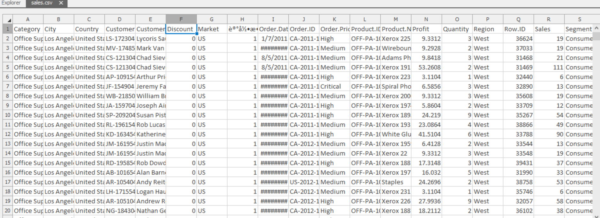
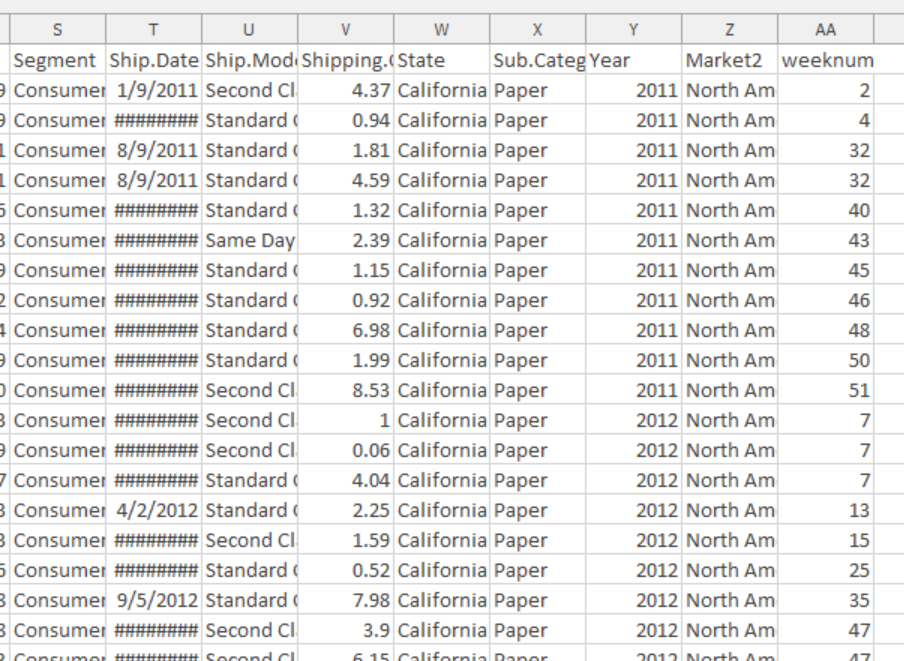
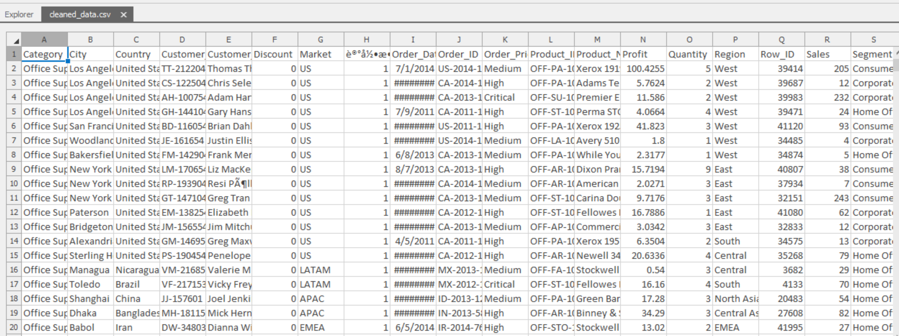
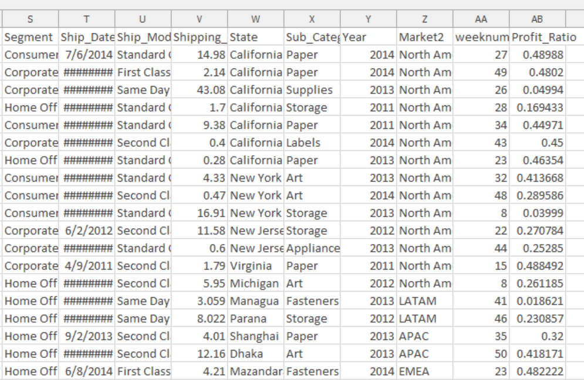
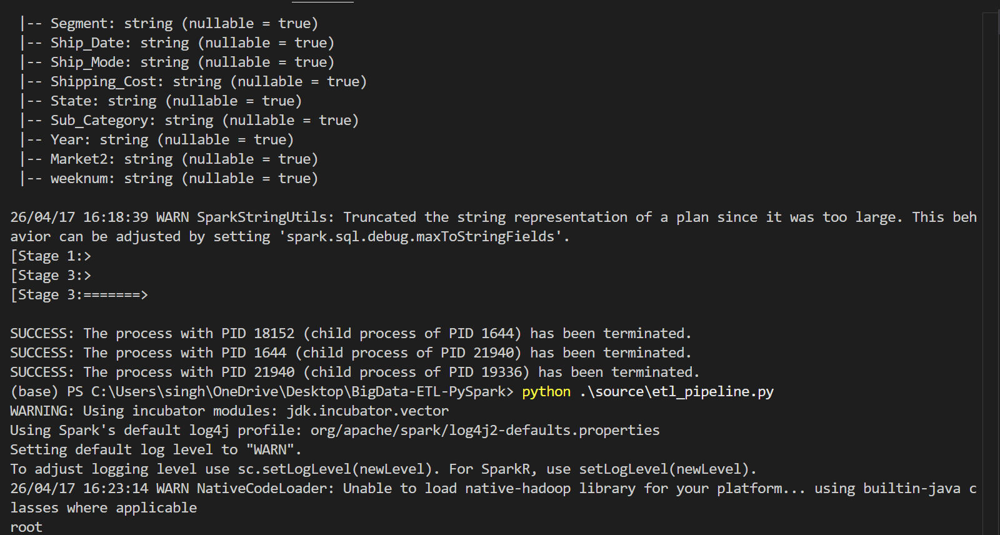
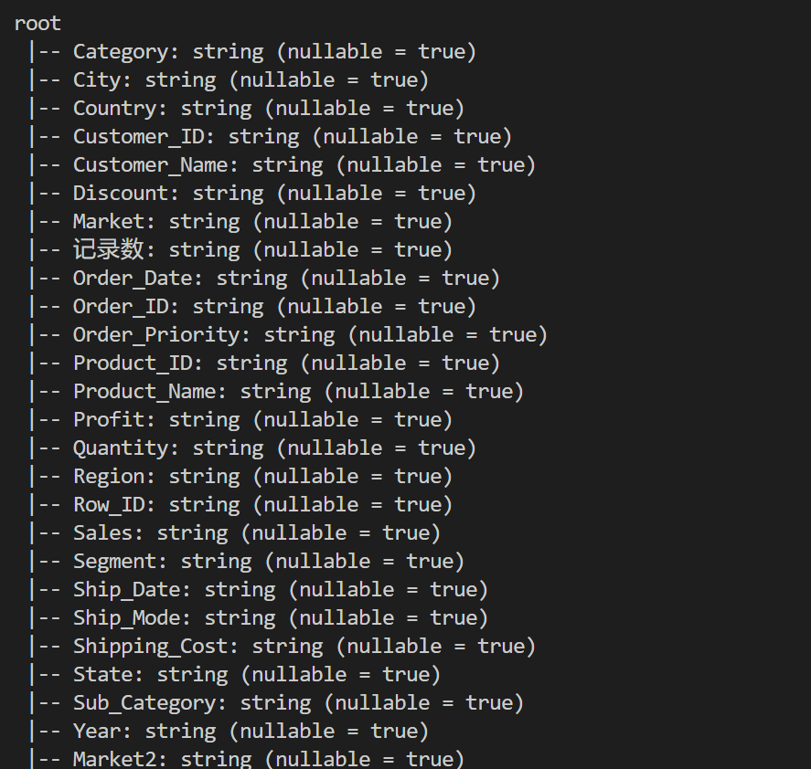
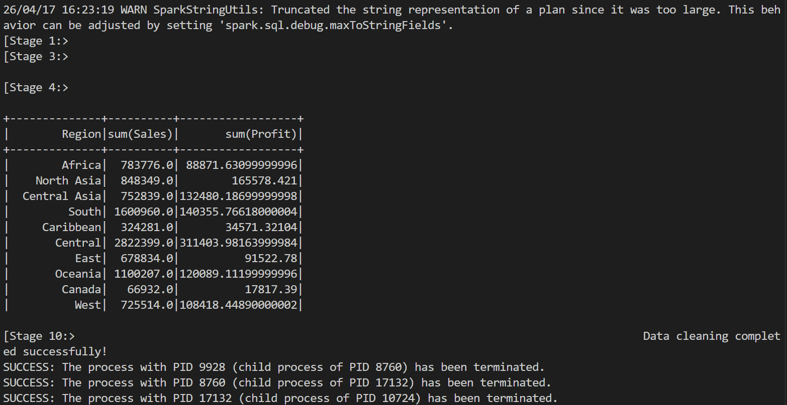

# Big Data ETL Pipeline using PySpark

## Overview

This project implements a scalable ETL (Extract, Transform, Load) pipeline using PySpark to process and analyze sales data.

The pipeline reads raw CSV data, performs data cleaning and transformation, and outputs a structured dataset ready for analytics.

## Features

* Handles messy CSV data (quotes, multiline records)
* Cleans and normalizes numeric fields (Sales, Profit)
* Removes null values and duplicates
* Safe type casting using `try_cast` to avoid failures
* Creates derived metric: **Profit Ratio**
* Exports cleaned dataset for downstream analytics

## Tech Stack

* Python
* PySpark
* Pandas (for local output)
* Apache Spark

---

## Project Structure

```
BigData-ETL-PySpark/
│
├── data/                  # Raw dataset
├── output/                # Cleaned output
├── source/                # ETL code
│   └── etl_pipeline.py
├── requirements.txt
├── README.md
└── .gitignore
```


## Setup Instructions

### 1. Clone Repository

```bash
git clone https://github.com/anitasingh071997/BigData-ETL-PySpark.git
cd BigData-ETL-PySpark
```

### 2. Install Dependencies

```bash
pip install -r requirements.txt
```

### 3. Run ETL Pipeline

```bash
python source/etl_pipeline.py
```

## Output

The cleaned dataset is saved as:

```
output/cleaned_data.csv
```

## Transformations Performed

* Removed null values and duplicates
* Cleaned numeric columns (Sales, Profit)
* Converted string → numeric using safe casting
* Created new column:

  * **Profit_Ratio = Profit / Sales**

## Screenshots

### Sample Data



### Output CSV



### Terminal Execution





## Key Learnings

* Handling dirty real-world datasets in PySpark
* Avoiding schema inference issues
* Safe data type conversion using `try_cast`
* Managing Spark limitations on Windows (Hadoop dependency)


## Future Improvements

* Add Spark SQL queries for analytics
* Integrate with cloud storage (AWS S3 / HDFS)
* Build dashboard using Power BI or Tableau

# Author
Anita Singh
